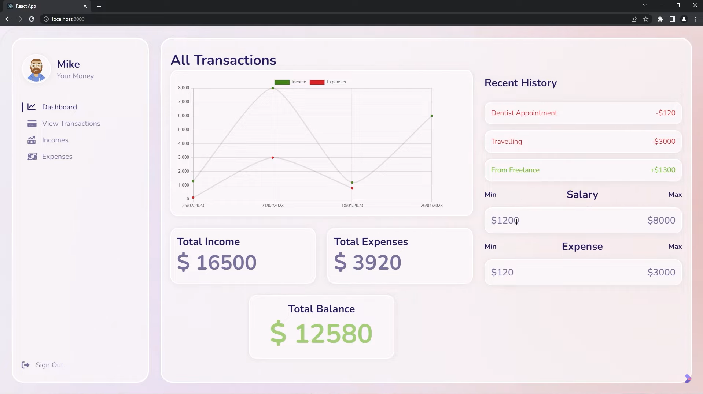

# Expense Tracker Application



## Description

This is a full-stack Expense Tracker application built with React for the front end and Node.js with Express for the back end. The application helps users track their income and expenses, view financial summaries, and manage their transactions effectively.

## Features

- **Dashboard Overview**: 
  - Displays total income, total expenses, and remaining balance.
  - Shows minimum and maximum values for income and expenses.
  - Toggle between viewing incomes and expenses.

- **Income Management**: 
  - Add, edit, and delete income entries.
  - Real-time updates of total income and visual representation in the dashboard.
  - Validation to ensure all fields are filled before submission.

- **Expense Management**: 
  - Add, edit, and delete expense entries.
  - Real-time updates of total expenses and visual representation in the dashboard.
  - Validation to ensure all fields are filled before submission.

- **Recent History**: 
  - Displays a history of recent transactions including both income and expenses.

- **Visuals**: 
  - Dynamic graphs and charts to visualize income and expense data.
  - Floating animation in the background.

- **Responsive Design**: 
  - Optimized for both desktop and mobile devices.

## Installation and Setup

### Clone the Repository

```bash
git clone https://github.com/yourusername/Expense-tracker--web-application.git
cd Expense-tracker--web-application
